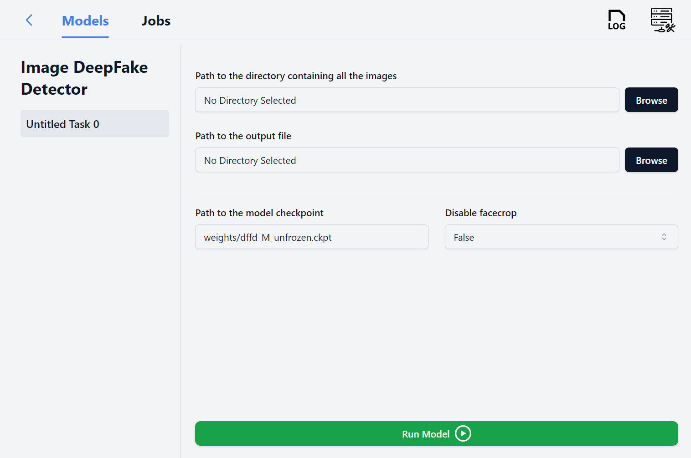

# DeepFakeDetector

This repo contains two different ML models/servers which can detect image and video deepfakes respectively. 

## Image Detection Model

Given a directory of images, the model can detect whether or not a image has been altered through AI tech (deepfake, faceswap etc). It can also extract face regions from the image and then check for any fakery. It can use the RescueBox app to give a nice UI for easy interaction. Following is a screenshot of it running on the RescueBox app. More info, including evaluation metrics, can be found at `image_model/img-app-info.md`. 

## Video Detection Models

### Preferred Model: EfficientNet
- **README Location**: `efficientNet/app_info.md`

### Alternative Model: XceptionNet
- **README Location**: `video_detector/app_info.md`
